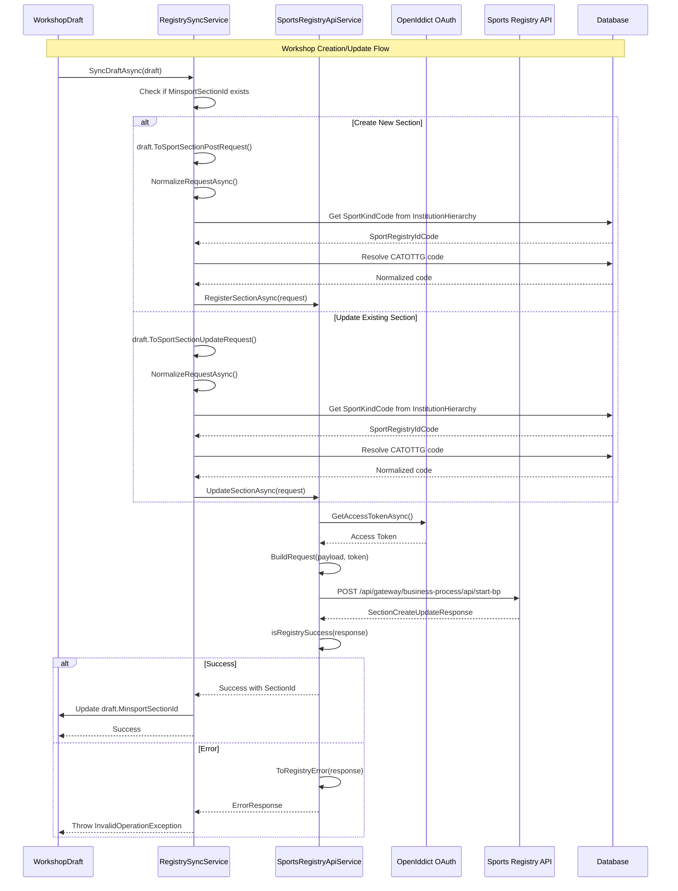
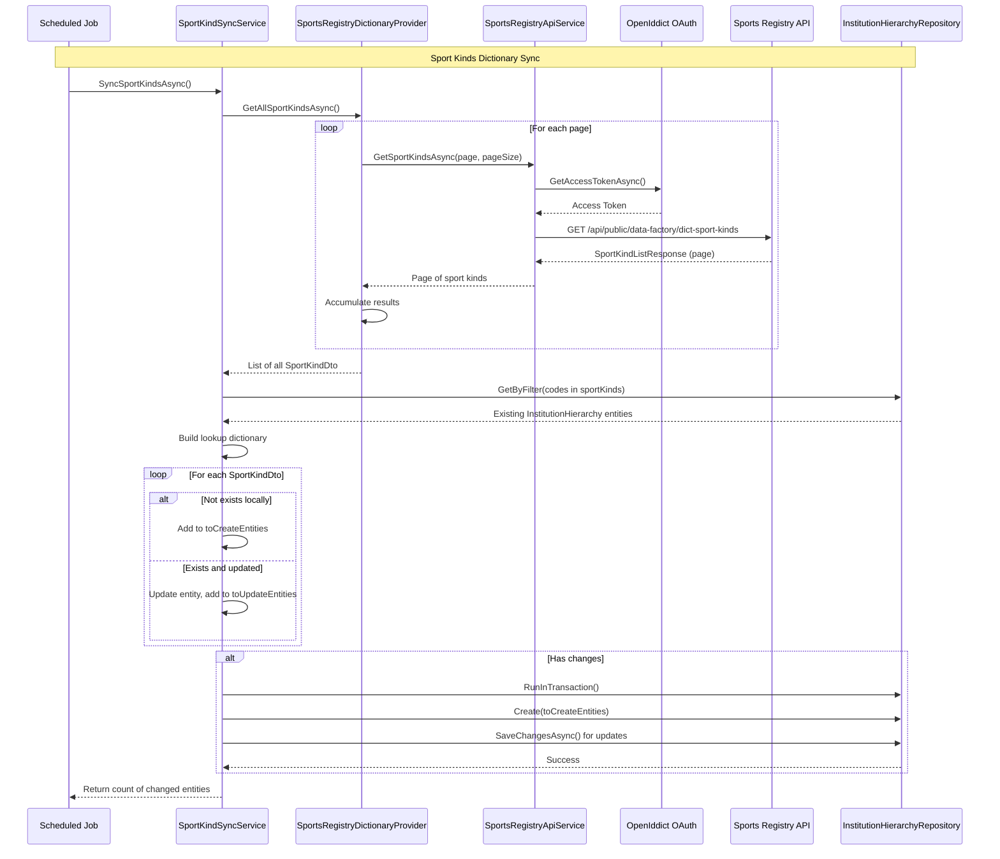
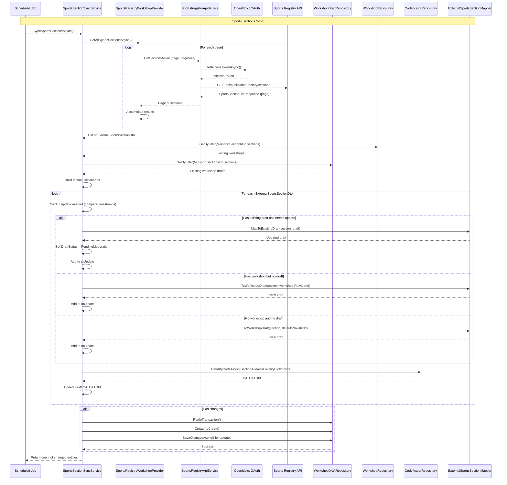

# Sports Registry Synchronization System

## Overview

This document provides a comprehensive explanation of the synchronization mechanism between the OutOfSchool platform and the external Ministry of Sports Registry system. The synchronization operates bidirectionally, allowing both outbound registration of workshops to the registry and inbound synchronization of sports sections from the registry.

## Architecture Components

The synchronization system is divided into two main projects:

### 1. OutOfSchool.SportsRegistryApiClient

This project contains the API client layer responsible for communication with the external Sports Registry system.

**Key Components:**

- **Services**: HTTP communication and data retrieval services
  - `SportsRegistryApiService`: Core API client for HTTP communication with the registry
  - `SportsRegistryDictionaryProvider`: Retrieves sport kinds dictionary data
  - `SportsRegistryWorkshopProviderService`: Retrieves sports sections (workshops) data
  - `DisabledSportsRegistryProviderService`: Stub implementation when registry is disabled

- **Models**: Data transfer objects for API communication
  - `SportsSectionBaseDto`: Base model for section data
  - `SportsSectionPostRequest`: Request model for creating new sections
  - `SportsSectionUpdateRequest`: Request model for updating existing sections
  - `SportKindDto`: Sport kind dictionary entry
  - `ExternalSportsSectionDto`: External section data from registry
  - `SectionCreateUpdateResponse`: Response from create/update operations

- **Interfaces**: Abstraction contracts
  - `ISportsRegistryApiService`: API service contract
  - `ISportsRegistryDictionaryProvider`: Dictionary provider contract
  - `ISportsRegistryWorkshopProvider`: Workshop provider contract

- **Configuration**: 
  - `SportsRegistryApiClientConfig`: Configuration settings (API URLs, OAuth credentials)

### 2. OutOfSchool.BusinessLogic/Services/SportsRegistry

This folder contains the business logic layer that orchestrates synchronization operations.

**Key Components:**

- **RegistrySyncService**: Orchestrates outbound synchronization of workshops/drafts to the registry
- **SportKindSyncService**: Synchronizes sport kinds dictionary from registry to local database
- **SportsSectionSyncService**: Synchronizes sports sections from registry to local workshops

## Synchronization Flows

### Flow 1: Outbound Workshop Registration (OutOfSchool → Sports Registry)

This flow handles the registration and updates of workshops from the OutOfSchool platform to the external Sports Registry.



**Process Steps:**

1. **Initiation**: `WorkshopDraftService` or `WorkshopService` calls `RegistrySyncService.SyncDraftAsync()` or `SyncWorkshopAsync()`

2. **Request Preparation**:
   - Determines if this is a CREATE (no `MinsportSectionId`) or UPDATE operation
   - Maps domain model to `SportsSectionPostRequest` or `SportsSectionUpdateRequest`
   - Normalizes request data:
     - Retrieves `SportKindCode` from `InstitutionHierarchy`
     - Resolves CATOTTG locality code from `Codeficator`

3. **Authentication**:
   - `SportsRegistryApiService` obtains OAuth2 access token via OpenIddict
   - Uses client credentials flow with configured ClientId/ClientSecret

4. **API Communication**:
   - Builds business process request with `businessProcessDefinitionKey`
   - Sends POST request to `/api/gateway/business-process/api/start-bp`
   - Registry executes business process and returns response

5. **Response Handling**:
   - Validates response status code and error fields
   - On success: Updates draft with `SectionId` from registry
   - On failure: Logs error and throws `InvalidOperationException`

**Key Data Transformations:**

- Workshop domain model → `SportsSectionBaseDto` (via extension methods)
- Image paths → Absolute URLs using `baseImageUrl`
- CATOTTG ID → CATOTTG registry code
- InstitutionHierarchy → Sport kind dictionary code

### Flow 2: Inbound Sport Kinds Synchronization (Sports Registry → OutOfSchool)

This flow synchronizes the sport kinds dictionary from the registry to the local `InstitutionHierarchy` table.



**Process Steps:**

1. **Initiation**: Scheduled job or manual trigger calls `SportKindSyncService.SyncSportKindsAsync()`

2. **Data Retrieval**:
   - `SportsRegistryDictionaryProvider` fetches all sport kinds via pagination
   - Each page request:
     - Obtains OAuth2 access token
     - Calls GET `/api/public/data-factory/dict-sport-kinds?pageNo={page}&pageSize={pageSize}`
     - Accumulates results until all pages are retrieved

3. **Comparison Logic**:
   - Loads existing `InstitutionHierarchy` entities matching registry codes
   - Creates lookup dictionary by `SportRegistryIdCode`
   - For each sport kind from registry:
     - **Not found locally**: Create new `InstitutionHierarchy` entity
     - **Found and updated**: Update `Title`, `SportsSectionNumeral`, `RegistrySyncDate`
     - **Found and unchanged**: Skip

4. **Database Update**:
   - Executes in transaction
   - Bulk creates new entities
   - Saves changes for updated entities
   - Returns count of created + updated entities

**Key Fields Synchronized:**

- `IdCode` → `SportRegistryIdCode`
- `Name` → `Title`
- `SportKindSectionNumeral` → `SportsSectionNumeral`
- `UpdatedAt` → `RegistrySyncDate`
- Fixed values: `HierarchyLevel = 2`, `InstitutionId = MinistryOfSportId`

### Flow 3: Inbound Sports Sections Synchronization (Sports Registry → OutOfSchool)

This flow synchronizes sports sections from the registry to local workshop drafts.



**Process Steps:**

1. **Initiation**: Scheduled job or manual trigger calls `SportsSectionSyncService.SyncSportsSectionsAsync()`

2. **Data Retrieval**:
   - `SportsRegistryWorkshopProvider` fetches all sections via pagination
   - Each page request:
     - Obtains OAuth2 access token
     - Calls GET `/api/public/data-factory/sections?pageNo={page}&pageSize={pageSize}`
     - Accumulates results until all pages are retrieved

3. **Comparison Logic**:
   - Loads existing workshops and drafts matching registry `SectionId`
   - Creates lookup dictionaries
   - For each section from registry:
     - Determines last local update timestamp (from draft or workshop)
     - Compares with `UpdatedInRegistryAt`
     - If registry is newer:
       - **Has draft**: Update existing draft via `MapToExistingDraft()`
       - **Has workshop only**: Create new draft from workshop's provider
       - **Neither**: Create new draft with default provider

4. **Data Mapping**:
   - Uses `ExternalSportsSectionToWorkshopDraftMapper`
   - Maps external section fields to `WorkshopDraft` structure
   - Resolves CATOTTG code to ID
   - Parses JSON fields (phones, schedule)
   - Transforms enums (practice format → form of learning)

5. **Database Update**:
   - Executes in transaction
   - Bulk creates new drafts
   - Saves changes for updated drafts
   - Returns count of created + updated entities

**Key Data Transformations:**

- `SectionName` → `Title`, `ShortTitle`
- `SectionDescription` → `WorkshopDescriptionItems`
- `SectionPracticeFormat` → `FormOfLearning` (ONLINE/OFFLINE/HYBRID → enum)
- `SectionPracticeCost` → `Price`
- `SectionMaxStudentsAmount` → `AvailableSeats` (capped at 1000)
- `SectionAgeFrom/AgeTo` → `MinAge/MaxAge`
- `SectionPhones` (JSON) → `List<PhoneNumber>`
- `SectionAddressLocalityDictIdCode` → `CATOTTGId` (via Codeficator lookup)
- Social media URLs → `SocialNetworks` collection

## Authentication & Authorization

The system uses OAuth2 Client Credentials flow for authentication with the Sports Registry:

1. **OpenIddict Integration**: Uses `OpenIddictClientService` for token management
2. **Provider Configuration**: Registry provider named "sportsregistry"
3. **Token Acquisition**: Automatic token retrieval and refresh
4. **Token Usage**: Bearer token included in all API requests

**Configuration Required:**

```json
{
  "SportsRegistryApiClient": {
    "Enable": true,
    "ApiUrl": "https://registry-api-url",
    "PlatformApiUrl": "https://platform-api-url",
    "TokenEndpoint": "https://auth-server/token",
    "ClientId": "your-client-id",
    "ClientSecret": "your-client-secret"
  }
}
```

## Error Handling

### Outbound Synchronization Errors

- **Validation Errors**: Thrown before API call if required fields are missing
- **API Errors**: Registry returns error in `ResultVariables.Errors` field
- **Network Errors**: HTTP communication failures
- **All errors**: Logged and thrown as `InvalidOperationException`

### Inbound Synchronization Errors

- **Page Fetch Errors**: Logged, sync stops, returns error response
- **Mapping Errors**: Logged, problematic records skipped
- **Database Errors**: Transaction rolled back, error logged and propagated

## Data Models

### SportsSectionBaseDto (Outbound)

Key fields sent to registry:

- `SectionName`: Workshop title
- `SectionSportKindDictIdCode`: Sport kind code from InstitutionHierarchy
- `SectionAgeFrom/AgeTo`: Age range
- `SectionIsInShlyahProject`: Champion path indicator
- `SectionAddressLocalityDictIdCode`: CATOTTG code
- `SectionAddressStreet/House`: Address details
- `SectionDescription`: Workshop description
- `SectionRegistrationFlow`: Enrollment procedure
- `SectionPhones`: Contact phone numbers
- `SectionEmail`: Contact email
- `SectionRegistrationFormUrl`: Registration link
- `SectionUrl/FacebookUrl/InstagramUrl`: Web presence
- `SectionPracticeFormat`: OFFLINE/ONLINE/HYBRID
- `SectionSelectionCriteria`: Competitive selection info
- `SectionPracticeCost`: Price
- `SectionMaxStudentsAmount`: Capacity
- `SectionTitlePhoto/Photos`: Image URLs
- `SectionTrainers`: Teacher IDs
- `SectionPracticePeriodDateFrom/To`: Study period (DD:MM format)
- `SectionSchedule`: List of schedule entries
- `SectionPozashkillyaModerationStatus`: Moderation status

### ExternalSportsSectionDto (Inbound)

Key fields received from registry:

- `SectionId`: Unique registry identifier
- `SectionName`: Section name
- `SectionDescription`: Description
- `SectionSportKindDictIdCode/Name`: Sport kind reference
- `SectionAgeFrom/AgeTo`: Age range
- `SectionIsInShlyahProject`: Champion path flag
- `SectionAddress*`: Full address breakdown (region, district, hromada, locality, street, house)
- `SectionEmail`: Contact email
- `SectionPhones`: JSON string of phone objects
- `SectionRegistrationFormUrl/Url/FacebookUrl/InstagramUrl`: URLs
- `SectionPracticeFormat`: Practice format code
- `SectionPracticeCost`: Price
- `SectionMaxStudentsAmount`: Capacity
- `SectionPracticePeriodDateFrom/To`: DateTime objects
- `SectionSchedule`: JSON string of schedule
- `SectionSelectionCriteria`: Selection criteria
- `SectionRegistrationFlow`: Registration flow
- `SectionPhotos/TitlePhoto`: Photo objects with ID and checksum
- `SectionTrainers`: JSON string of trainer data
- `SectionPozashkillyaModerationStatus`: Moderation status
- `SectionStatusDictIdCode/Name`: Status reference
- `OrganizationCode`: Organization identifier
- `AddedToRegistryAt`: Creation timestamp
- `UpdatedInRegistryAt`: Last update timestamp

### SportKindDto (Inbound)

Dictionary entry for sport kinds:

- `Id`: Registry GUID
- `IdCode`: Numeric code (mapped to `SportRegistryIdCode`)
- `Name`: Sport kind name
- `SportKindSectionName`: Section name
- `SportKindSectionNumeral`: Section numeral
- `SportKindSectionIdCode`: Section code
- `IsActive`: Active status
- `UpdatedAt`: Last update timestamp

## Business Process Integration

The registry uses a business process engine (likely Camunda/BPMN) for section registration:

1. **Process Keys**:
   - Create: Defined in `RegistryConstants.SectionCreateProcessKey`
   - Update: Defined in `RegistryConstants.SectionUpdateProcessKey`

2. **Request Structure**:
```json
{
  "businessProcessDefinitionKey": "section-create-process",
  "startVariables": {
    "data": {
      // SportsSectionPostRequest fields
    }
  }
}
```

3. **Response Structure**:
```json
{
  "resultVariables": {
    "code": "200",
    "sectionId": "guid-value",
    "errors": null
  }
}
```

## Extension Points

### Disabled Mode

When registry integration is disabled, `DisabledSportsRegistryProviderService` provides stub implementations that return empty results without making external calls.

### Custom Mappers

The system uses extension methods for mapping:

- `WorkshopDraft.ToSportSectionPostRequest()`: Draft → Create request
- `WorkshopDraft.ToSportSectionUpdateRequest()`: Draft → Update request
- `WorkshopV2Dto.ToSportSectionUpdateRequest()`: Workshop → Update request
- `ExternalSportsSectionDto.ToWorkshopDraft()`: External section → New draft
- `ExternalSportsSectionDto.MapToExistingDraft()`: External section → Update existing draft

These can be customized to adjust field mappings.

## Logging

All services implement comprehensive logging:

- **Information**: Successful operations, sync counts
- **Warning**: Empty results, skipped records
- **Error**: API failures, validation errors, exceptions

Log messages include contextual data (IDs, counts, error details) for troubleshooting.

## Testing Considerations

### Unit Testing

- Mock `ISportsRegistryApiService` for business logic tests
- Mock `ICodeficatorService` and `IInstitutionHierarchyService` for sync service tests
- Test mapping logic independently

### Integration Testing

- Use test registry environment
- Verify OAuth token acquisition
- Test error response handling
- Validate data transformations end-to-end

### Manual Testing

- Enable/disable registry integration via configuration
- Test create and update flows separately
- Verify draft status transitions
- Check CATOTTG code resolution
- Validate image URL generation

## Performance Considerations

1. **Pagination**: Inbound sync uses pagination (default 50 records per page) to handle large datasets
2. **Bulk Operations**: Database updates use bulk create and tracked entity updates
3. **Transactions**: All database operations wrapped in transactions for consistency
4. **Lookup Optimization**: Pre-loads existing entities and builds in-memory dictionaries for comparison
5. **Selective Updates**: Only updates entities when registry timestamp is newer

## Future Enhancements

Current TODOs identified in the codebase:

1. **Schedule Mapping**: Complete mapping of `SectionSchedule` JSON to `DateTimeRangeDraft`
2. **Image Synchronization**: Implement photo download and storage from registry
3. **Provider Resolution**: Replace hardcoded provider GUID with proper lookup logic
4. **Additional Field Mappings**: Complete all field mappings in `MapToExistingDraft()`
5. **Trainer Synchronization**: Parse and map trainer data from JSON
6. **Status Synchronization**: Handle section status updates from registry

## Troubleshooting

### Common Issues

1. **Authentication Failures**:
   - Verify ClientId/ClientSecret configuration
   - Check OpenIddict provider registration
   - Ensure token endpoint is accessible

2. **Validation Errors**:
   - Check `SportRegistryIdCode` exists in InstitutionHierarchy
   - Verify CATOTTG codes are valid
   - Ensure required fields are populated

3. **Sync Failures**:
   - Check registry API availability
   - Verify pagination parameters
   - Review error logs for specific failure reasons

4. **Data Mismatches**:
   - Compare timestamps to understand update logic
   - Verify mapping transformations
   - Check enum conversions

## Summary

The Sports Registry synchronization system provides robust bidirectional integration between OutOfSchool and the external Ministry of Sports Registry. It handles workshop registration, sport kinds dictionary synchronization, and sports sections import with comprehensive error handling, logging, and data transformation capabilities.
